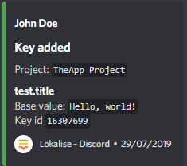

# Lokalise-Discord-Webhook

Webhook redirecter written in nodejs using express to redirect webhooks received from Lokalise to Discord. 
When receiving a POST request from Lokalise it sends an embed to a Discord webhook with all the information from the Lokalise request.

## Examples 

## How to install

Clone the repository

	git clone https://github.com/theking465/lokalise-discord-webhook.git

Install dependencies

	npm install

Rename `.env.example` to `.env` and fill in your PORT and receiving discord webhook.
If no PORT is given, it will default to 3000. 
To get your discord webhook url go to the channel where you'd like to receive the messages. Open the settings of that channel and click on `integrations`. Select webhooks and click `Create webhook`. Copy the webhook URL and paste it in the `.env` file.

Setup the Lokalise webhook at project -> integrations -> webhooks. The webhook url is the url where you will host this server followed by your port.
Example: `www.example.com:3000`

To start the server execute the following command on your server

	npm start

## Customization 

The embeds can be customized. The color scheme can be adapted in `variables.json[colors]`. The values are integers in decimal form of a hex code.
To get those values go to your color picker of choice and copy the HEX value without the `#`. Then convert that hex value over to a decimal number using any online convertor. This is needed since Discord requires this format of colors.

You can toggle if the user their email is showed in `variables.json[privacy]`.

## How to contribute

Issues and PRs are always welcome for any feature request or bug report. 
When opening a pull request, make sure it follows the eslint configuration.

## Support

If you need support for this project, please create a Github issue and describe your request.
